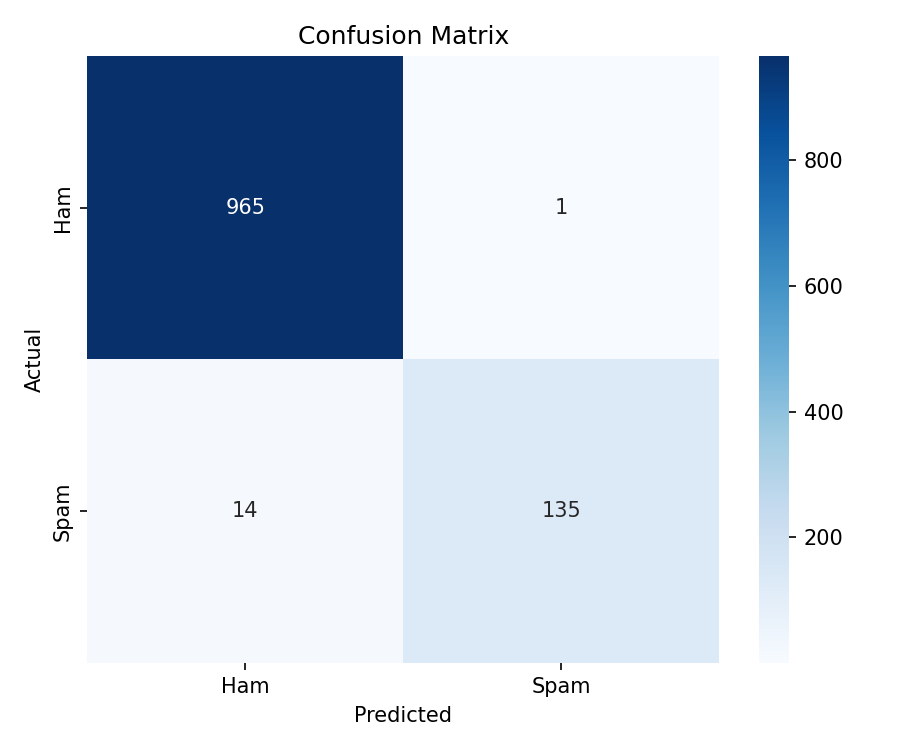
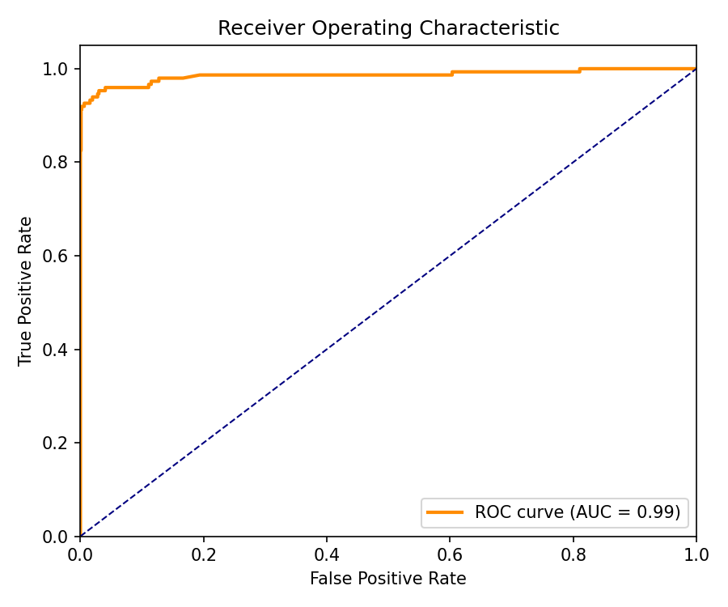

# Spam Email Classifier

A machine learning pipeline that classifies SMS messages as **spam** or **ham** 
using TF-IDF vectorization and three classifiers — Naive Bayes, Logistic 
Regression, and SVM.

---

## Results

| Model                | Accuracy |
|----------------------|----------|
| Naive Bayes          | 97.13%    |
| Logistic Regression  | 98.68%    |
| SVM (best)           | 98.65%    |

### Confusion Matrix


### ROC Curve



## Project Structure
spam-email-classifier/
├── data/             # Raw dataset (not tracked by git)
├── notebooks/        # EDA notebook
├── src/              # Source code
│   ├── load_data.py
│   ├── preprocess.py
│   ├── train.py
│   └── evaluate.py
├── models/           # Saved model (not tracked by git)
├── outputs/          # Plots and figures
└── requirements.txt

## How to Run

```bash
pip install -r requirements.txt

cd src
python train.py      # trains and saves best model
python evaluate.py   # generates plots and metrics
```

## Tech Stack
Python · scikit-learn · Pandas · TF-IDF · Matplotlib · Seaborn